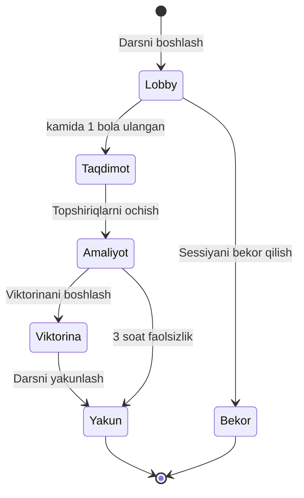
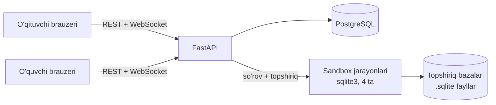

# SQL Maktab — MVP rejasi

2026-09-25

> Claude hujjatidan eksport qilingan nusxa. Tahrirlanadigan asl versiya:
> [Claude hujjati](https://claude.ai/code/artifact/e4a50de0-82cd-40f3-86b3-28a5e6649f33).
> Asosiy tadqiqot: [../README.md](../README.md).

## Maqsad va muammo

SQL Maktab (ishchi nom) — 9–11-sinflar uchun tayyor SQL darslari platformasi. O'qituvchi material tayyorlamaydi, darsni o'tkazadi. Bolalar brauzerda haqiqiy SQL so'rov yozadi, tizim esa uni darhol tekshiradi.

**Muammo.** 9–11-sinfda ma'lumotlar bazasi mavzusi bor, lekin tayyor interaktiv material yo'q. 25 bola × 10 topshiriq — bir darsda 250 ta so'rovni qo'lda tekshirib bo'lmaydi. Natijada SQL daftarda yoki proyektorda "ko'rib" o'tiladi.

**Bozor bo'shlig'i.** LUWO faqat 1–8-sinflarni qamraydi: sinflar filtri 11-sinfgacha boradi, lekin 9–11 uchun kontent yo'q (tadqiqot, 2026-09-25). 8-sinfda Python bor, SQL yo'q. LUWO bilan ishlaydigan maktablarda 9–11-sinflar bo'sh qolgan.

**Uchta va'da:**

1. **Tayyor dars** — brifing, taqdimot, SQL topshiriqlari va viktorina bitta paketda
2. **Jonli monitor** — kim qaysi topshiriqda tiqilganini o'qituvchi darhol ko'radi
3. **Avtomatik tekshiruv** — har bir so'rov soniyada baholanadi, natijalar o'zi yig'iladi

## Foydalanuvchilar va rollar

MVP'da to'rtta rol bor. Ulardan ikkitasi — o'qituvchi va o'quvchi — har kuni ishlatadi.

| Rol | Kim | MVP'da nima qiladi | Kirish usuli |
|---|---|---|---|
| O'qituvchi | Informatika o'qituvchisi | Darsga tayyorlanadi, jonli dars o'tkazadi, monitor va natijalarni ko'radi | Email + parol |
| O'quvchi | 9–11-sinf, 15–17 yosh | Darsga qo'shiladi, SQL yozadi, viktorinaga javob beradi, uy vazifasini bajaradi | Kod + ro'yxatdan ism + 4 xonali PIN |
| Maktab admini | Direktor o'rinbosari yoki IT mas'ul | Sinflar va o'quvchilarni import qiladi, o'qituvchilarni biriktiradi | Email + parol |
| Kontent muallifi | Platforma egasi (siz) | Dars, slayd, topshiriq va viktorina yaratadi | Ichki admin panel |

O'quvchi uchun parol yo'q, LUWO'dagi kabi. 15 yoshli bola yozishni biladi, lekin parol unutilsa dars to'xtaydi — PIN'ni o'qituvchi bir bosishda ko'rsatadi.

## MVP doirasi

MVP bitta savolga javob beradi: o'qituvchi 9-sinfda SQL darsini tayyorgarliksiz o'tkaza oladimi, bolalar esa mustaqil so'rov yoza oladimi? Shuning uchun kontent — **faqat 9-sinf, 1-modul, 8 dars**. 10–11-sinflar uchun faqat dastur tuzilishi tayyorlanadi.

| Funksiya | MVP (v1) | Keyingi versiya |
|---|---|---|
| Kontent | 9-sinf 1-modul: 8 dars, ~80 topshiriq | 9–11-sinf to'liq yil (~90 dars) |
| O'qituvchi paneli | Sinflar, o'quvchilar, dars tayyorgarligi, natijalar | Ko'nikmalar xaritasi, standartlarga moslik |
| Jonli dars | Lobby, taqdimot, amaliyot monitori, viktorina, yakun | "Sinfga ko'rsatish" (bolaning ekrani), o'yin qadami |
| O'quvchi ilovasi | Kod + PIN kirish, SQL muharrir, viktorina | Shaxsiy profil, yutuqlar |
| SQL tekshiruv | Natija, jadval holati, talab qilingan konstruksiya | AI izohli maslahat |
| Uy vazifasi | O'zgarmas 8 xonali kod bilan | Muddatli topshiriqlar, eslatmalar |
| Maktab boshqaruvi | CSV import, o'qituvchi biriktirish | Ko'p maktab, to'lov, shartnomalar |
| Tillar | O'zbek (lotin) + rus | Ingliz |
| Hisobotlar | Dars va o'quvchi bo'yicha | Ota-ona hisoboti, eksport |
| Qurilmalar | Kompyuter brauzeri (Chrome, Edge) | Planshet, mobil |

## O'quv dasturi va dars tuzilishi

Dastur spiral tuzilgan: 9-sinf bitta jadvaldan so'rov oladi, 10-sinf jadvallarni bog'laydi, 11-sinf bazani o'zi loyihalaydi. Har sinfda ~30 dars (haftasiga 1 soat).

| Sinf | Yo'nalish | Asosiy SQL | Yakuniy loyiha |
|---|---|---|---|
| 9 | Ma'lumotlar va jadvallar | `SELECT`, `WHERE`, `ORDER BY`, `LIMIT`, `COUNT/SUM/AVG/MIN/MAX`, `GROUP BY` | Maktab kutubxonasi statistikasi |
| 10 | Bog'langan jadvallar | Kalitlar, `JOIN`, `HAVING`, ichki so'rov, `INSERT/UPDATE/DELETE`, `CREATE TABLE` | Onlayn do'kon bazasi |
| 11 | Loyihalash va tahlil | Normallashtirish (1NF–3NF), ER-diagramma, indeks, tranzaksiya, `VIEW`, window funksiyalar, SQL injection | O'z mavzusidagi baza + tahlil hisoboti |

**MVP moduli — 9-sinf, 1-modul, 8 dars:** ma'lumotlar bazasi nima · `SELECT` · `WHERE` · `AND/OR/IN/BETWEEN` · `LIKE` va matn · `ORDER BY` + `LIMIT` · agregat funksiyalar · mini-loyiha.

**Ma'lumotlar to'plamlari** bolaga tanish mavzularda va to'liq to'qima: maktab (o'quvchilar, fanlar, baholar), futbol ligasi, kutubxona, onlayn do'kon, ob-havo. Real odamlar haqidagi ma'lumot ishlatilmaydi.

### Bitta dars (45 daqiqa)

| Qism | Kim uchun | Vaqt | Tarkib |
|---|---|---|---|
| Brifing | O'qituvchi, darsdan oldin | 5 daq o'qish | Maqsad, kutiladigan xatolar, kimga e'tibor berish |
| Taqdimot | Butun sinf | 10–12 daq | 8–12 slayd; har slaydda Maqsad · Nima deyish kerak · Sinfdan so'rang · Javob |
| Amaliyot | Har bir bola | 20–25 daq | 8–12 SQL topshiriq, oddiydan murakkabga |
| Viktorina | Butun sinf | 5 daq | 5–8 savol, har biri 45 soniya |

LUWO'da kuzatilgan dars shunday taqsimlangan edi: taqdimot 9, amaliyot 15, viktorina 4,5 daqiqa. SQL yozish klaviatura mashqidan sekinroq, shuning uchun amaliyotga ko'proq vaqt ajratilgan.

## Asosiy oqimlar

Jonli dars — bu boshi va oxiri aniq sessiya. Qadamdan qadamga faqat o'qituvchi o'tkazadi, yakunlanmay qolgan dars esa o'zi yopiladi.



Har bir holat serverda saqlanadi. O'qituvchi sahifani yangilasa yoki internet uzilsa, dars o'sha joydan davom etadi.

### 1. Darsga tayyorlanish

1. O'qituvchi sinf sahifasida "Darsga tayyorlanish" ni bosadi
2. Brifing, slaydlar va o'qituvchi izohlarini ko'radi
3. **Barcha amaliyot topshiriqlarini etalon yechimi bilan ko'radi** va ularni o'zi bajarib ko'ra oladi — LUWO'da bu imkoniyat yo'q
4. Viktorina savollarini to'g'ri javoblari bilan ko'radi

### 2. Jonli dars

1. "Darsni boshlash" → ekranda 6 xonali dars kodi chiqadi
2. Bola kodni kiritadi → sinf ro'yxatidan ismini tanlaydi → PIN teradi
3. Lobby: o'qituvchi kim kirganini real vaqtda ko'radi. Kechikkanlar dars davomida ham qo'shiladi
4. Taqdimot: o'qituvchi slaydni suradi, bolalar ekranida ham shu slayd turadi
5. Amaliyot: har bola o'z tezligida ishlaydi, o'qituvchi monitorni kuzatadi
6. Viktorina: savol proyektorda, javob bolaning ekranida; 45 soniya
7. Yakun: natijalar saqlanadi, bolalar ekranida shaxsiy natija chiqadi

### 3. Monitor signallari

| Signal | Qachon chiqadi | O'qituvchi nima qiladi |
|---|---|---|
| Tiqilib qoldi | Bitta topshiriqda 3 daqiqa | Yoniga borib yordam beradi |
| Ko'p xato | Ketma-ket 3 noto'g'ri urinish | Xato matnini monitorda ko'radi |
| Boshqa tabda | Bola dars oynasidan chiqdi | Ogohlantiradi |
| Oflayn | Ulanish 20 soniyadan ko'p uzildi | Internetni tekshiradi |
| Qo'l ko'tardi | Bola tugmani bosdi | "Ko'rdim" deb belgilaydi |

Chegaralar sozlanadi. SQL yozish klaviatura mashqidan sekinroq, shuning uchun "tiqilib qoldi" uchun LUWO'dagi 2 daqiqa o'rniga 3 daqiqa olingan.

### 4. Uy vazifasi

Har sinfda o'zgarmas 8 xonali uy kodi bor. Bola uyda kod, ism va PIN bilan kirib, tugatmagan topshiriqlarini davom ettiradi. Uyda viktorina yo'q, faqat amaliyot.

### 5. Natijalar

Dars tugagach, o'qituvchi uchta ko'rinishni oladi: bola bo'yicha (topshiriqlar, urinishlar, viktorina), topshiriq bo'yicha (eng ko'p xato qilingan joy) va sinf bo'yicha (o'rtacha natija).

## SQL mashq dvigateli

O'quvchi SQL'i serverda, har safar yangi **SQLite** nusxasida bajariladi va etalon yechim bilan solishtiriladi. Platformaning o'z ma'lumotlari PostgreSQL'da turadi, o'quvchi so'rovi unga hech qachon tegmaydi.

**Nega SQLite:** har topshiriq bazasi 50–200 KB, xotirada 1 ms da ochiladi, bola hech narsani buzolmaydi. 9–11-sinf dasturining hammasini qo'llaydi, jumladan `JOIN`, `VIEW`, tranzaksiya va window funksiyalar.

### Ikki tugma

| Tugma | Nima qiladi | Urinish hisoblanadimi |
|---|---|---|
| **Bajarish** | So'rovni ishlatib, natija jadvalini ko'rsatadi | Yo'q |
| **Tekshirish** | Etalon bilan solishtirib, "to'g'ri / noto'g'ri" deydi | Ha |

### Tekshiruv turlari

| Tur | Misol | Qanday tekshiriladi |
|---|---|---|
| Natija | "Toshkentlik o'quvchilarni chiqaring" | Natija to'plami etalon bilan solishtiriladi |
| Jadval holati | `INSERT`, `UPDATE`, `DELETE` | Bajarilgandan keyingi jadval etalon holat bilan solishtiriladi |
| Tuzilma | `CREATE TABLE` | Ustunlar, turlar va kalitlar `PRAGMA table_info` orqali |
| Talab qilingan konstruksiya | "`JOIN` bilan yozing" | So'rov `sqlglot` bilan tahlil qilinib, `JOIN` bor-yo'qligi qaraladi |
| Tuzatish | Xato so'rovni tuzatish | Natija bo'yicha |
| Qisqa javob | "Bu so'rov nechta qator qaytaradi?" | Son yoki variant |

### Solishtirish qoidalari

- Ustun **nomlari** hisobga olinmaydi (`AS` taxallusi erkin), ustunlar **soni va tartibi** hisobga olinadi
- Qatorlar tartibi faqat topshiriqda `order_matters: true` bo'lsa muhim
- Kasr sonlar 2 xonagacha yaxlitlanadi, matnlar chetidagi bo'sh joysiz solishtiriladi
- **Yashirin baza:** so'rov ikkinchi, tuzilishi bir xil, lekin ma'lumoti boshqa bazada ham ishlatiladi. `SELECT 'Ali', 9` kabi javobni yodlab yozish o'tmaydi

### Xatoga javob

Bola xom SQLite xatosini emas, o'zbekcha izohni ko'radi:

| SQLite xatosi | Bola ko'radi |
|---|---|
| `no such column: ism1` | `ism1` degan ustun yo'q. Balki `ism`? |
| `no such table: oquvchi` | `oquvchi` degan jadval yo'q. Mavjudlari: `oquvchilar`, `fanlar` |
| `near "FORM": syntax error` | `FORM` yonida xato. Balki `FROM`? |
| Natija farq qiladi | Sizda 12 qator, kutilgan 8 qator. `WHERE` shartini tekshiring |

Taxminiy so'z tavsiyasi `difflib` bilan jadval va ustun nomlaridan olinadi. 2 ta noto'g'ri urinishdan keyin 1-maslahat, 4 tadan keyin 2-maslahat ochiladi. Jonli darsda yechim ko'rsatilmaydi, dars yakunlangandan keyin ochiladi.

### Topshiriq formati

Har topshiriq kontent muallifi yozadigan bitta YAML fayl:

```yaml
id: 9-1-3-05
title: Toshkentlik o'quvchilar
dataset: maktab_v1
prompt: Toshkentda yashaydigan o'quvchilarning ismi va sinfini chiqaring.
check:
  type: result
  reference_sql: SELECT ism, sinf FROM oquvchilar WHERE shahar = 'Toshkent'
  order_matters: false
  hidden_dataset: maktab_v1_hidden
  require: []
hints:
  - WHERE bilan shahar ustunini filtrlang.
  - Matn qiymati bittalik qo'shtirnoqda yoziladi, masalan 'Toshkent'.
```

## Ekranlar ro'yxati

MVP'da 19 ta ekran: o'qituvchi uchun 10, o'quvchi uchun 7, admin uchun 2. Eng ko'p ish talab qiladiganlari — monitor va SQL muharrir.

| # | Ekran | Ilova | Asosiy elementlar |
|---|---|---|---|
| 1 | Kirish | O'qituvchi | Email, parol, parolni tiklash |
| 2 | Bosh sahifa | O'qituvchi | Bugungi darslar, davom etayotgan dars banneri |
| 3 | Sinflar | O'qituvchi | 9/10/11 filtri, sinf kartochkalari (mobilda ham o'qiladi) |
| 4 | Sinf sahifasi | O'qituvchi | Keyingi dars, uy vazifasi kodi, sinf tili, modullar bo'yicha natijalar |
| 5 | Dars tayyorgarligi | O'qituvchi | Brifing · Slaydlar · Topshiriqlar + yechimlar · Viktorina |
| 6 | Lobby | O'qituvchi | 6 xonali kod, kirgan/kirmagan bolalar, "Darsni boshlash" |
| 7 | Monitor: taqdimot | O'qituvchi | Slayd, 4 bo'limli izoh, miniatyuralar, ulanganlar soni |
| 8 | Monitor: amaliyot | O'qituvchi | Topshiriq qatorlari, bola chiplari, signallar, PIN qidiruv, bolaning oxirgi so'rovi, javobni qo'lda qabul qilish |
| 9 | Monitor: viktorina | O'qituvchi | Savol, taymer, javob berganlar soni, natija diagrammasi |
| 10 | Natijalar va o'quvchilar | O'qituvchi | Dars va bola hisobotlari, CSV import, PIN kartochkalarini chop etish |
| 11 | Kod kiritish | O'quvchi | "Darsda" / "Uyda", 6 yoki 8 xonali kod |
| 12 | Ism tanlash | O'quvchi | Sinf ro'yxati (ism + familiya harfi), qidiruv |
| 13 | PIN | O'quvchi | 4 xonali PIN, ekrandagi raqamlar |
| 14 | Kutish / slayd | O'quvchi | "O'qituvchi boshlashini kuting", keyin joriy slayd |
| 15 | SQL muharrir | O'quvchi | Topshiriq, jadvallar sxemasi, muharrir, Bajarish, Tekshirish, natija jadvali, maslahat, qo'l ko'tarish |
| 16 | Viktorina javobi | O'quvchi | 4 ta rangli tugma (rang + shakl), "javobingiz qabul qilindi" |
| 17 | Dars yakuni | O'quvchi | Shaxsiy natija: topshiriqlar, viktorina, keyingi qadam |
| 18 | Maktab va sinflar | Admin | Sinflar, o'qituvchi biriktirish |
| 19 | Import | Admin | CSV yuklash, lotin/kirill tekshiruvi, takroriy ismlar |

SQL muharriri uchun **CodeMirror 6** (SQL sintaksisi, jadval va ustun nomlarini avtomatik to'ldirish). Jadvallar sxemasi muharrir yonida doim ko'rinib turadi — bola ustun nomini eslab qolishi shart emas.

## Arxitektura va texnologiyalar

Back-end to'liq Python: FastAPI, PostgreSQL va alohida SQL sandbox jarayonlari. MVP bitta serverda Docker Compose bilan ishlaydi.



Brauzerlar faqat FastAPI bilan gaplashadi. Bola so'rovi sandbox jarayoniga uzatiladi, natija esa WebSocket orqali o'qituvchi monitoriga ketadi.

| Qatlam | Tanlov | Nega |
|---|---|---|
| Til | Python 3.12 | Siz tanlagan til; `sqlite3` standart kutubxonada bor |
| API | FastAPI + Uvicorn, Pydantic v2 | Asinxron, WebSocket ichida bor, avtomatik OpenAPI hujjat |
| Platforma bazasi | PostgreSQL 16, SQLAlchemy 2 + Alembic | Kompyuteringizda bor; migratsiyalar bilan |
| O'quvchi SQL'i | `sqlite3` alohida jarayonlarda (`ProcessPoolExecutor`, 4 ta) | Og'ir so'rov API'ni to'xtatmaydi, jarayon qulasa ham API ishlaydi |
| SQL tahlili | `sqlglot` | "`JOIN` ishlatilganmi" kabi tekshiruvlar uchun |
| Real vaqt | FastAPI WebSocket, xona holati xotirada | MVP uchun bitta jarayon ~500 ulanishga yetadi; ko'paysa Redis pub/sub |
| Front-end | React + Vite + TypeScript, Tailwind, CodeMirror 6 | Monitor va SQL muharrir uchun kerak; bitta repoda ikki ilova |
| Autentifikatsiya | Access token 15 daq + refresh token (httpOnly cookie) | Dars paytida ham fonda yangilanadi |
| Tillar | O'zbek (lotin), rus | Interfeys tili va sinf tili alohida |
| Server | 1 ta VPS (4 vCPU, 8 GB), O'zbekistonda; Caddy (HTTPS) | Lokalizatsiya talabi, mahalliy tezlik |
| Kuzatuv | Sentry, har kuni `pg_dump` | Xatolar va zaxira nusxa |

**Qayta ulanish:** bola yoki o'qituvchi WebSocket'ga qayta ulanganda server darsning to'liq holatini (qadam, slayd, har bola progressi) bitta xabarda yuboradi. Maktab interneti uzilib tursa ham monitor to'g'ri qoladi.

## Ma'lumotlar modeli

PostgreSQL'da 16 ta jadval, uch guruhda: maktab, kontent va dars sessiyalari. Eng ko'p yoziladigani — `attempts`: har bir "Tekshirish" bitta qator.

| Guruh | Jadval | Asosiy ustunlar | Izoh |
|---|---|---|---|
| Maktab | `schools` | id, name, region | |
| Maktab | `users` | id, school_id, role, email, password_hash, ui_lang | O'qituvchi va admin |
| Maktab | `classes` | id, school_id, grade (9–11), letter, content_lang, homework_code | `homework_code` — 8 xonali, noyob |
| Maktab | `teacher_classes` | teacher_id, class_id | Ko'pga-ko'p |
| Maktab | `students` | id, class_id, first_name, last_name, pin_enc, avatar | PIN shifrlangan, o'qituvchi ko'ra oladi |
| Kontent | `modules` | id, grade, position, title | |
| Kontent | `lessons` | id, module_id, position, title, briefing, version | Versiya — o'tkazilgan dars eski versiyada qoladi |
| Kontent | `slides` | id, lesson_id, position, body, notes | `notes` = maqsad, nima deyish, so'rang, javob |
| Kontent | `datasets` | id, name, file_path, hidden_file_path, schema | .sqlite fayllar va ularning sxemasi |
| Kontent | `tasks` | id, lesson_id, position, dataset_id, spec | `spec` — YAML'dan olingan JSON |
| Kontent | `quiz_questions` | id, lesson_id, position, text, options, correct, time_limit | `time_limit` = 45 |
| Sessiya | `sessions` | id, class_id, lesson_id, teacher_id, kind, join_code, status, step, slide, started_at, ended_at | `kind`: live / homework |
| Sessiya | `participants` | session_id, student_id, joined_at, last_seen_at | Kim kirgani va oxirgi signal |
| Sessiya | `attempts` | id, session_id, student_id, task_id, sql, verdict, error_code, ms, created_at | Har bir tekshiruv |
| Sessiya | `quiz_answers` | session_id, student_id, question_id, option, answered_ms, points | Ball tezlikka bog'liq |
| Sessiya | `events` | session_id, student_id, type, at | hand, tab_hidden, idle, offline |

Monitor va hisobotlar `attempts` dan hisoblanadi. Qaysi topshiriq necha marta va qanday xato bilan bajarilgani keyin kontentni yaxshilash uchun eng qimmatli ma'lumot bo'ladi.

## API va real vaqt eventlari

Ma'lumot olish va saqlash — REST (`/api/v1`), dars paytidagi hamma narsa — bitta WebSocket (`/ws/session/{id}`). Dars paytida o'qituvchi sahifasi HTTP so'rov yubormaydi.

### REST

| Metod | Yo'l | Vazifasi |
|---|---|---|
| POST | `/auth/login`, `/auth/refresh` | O'qituvchi kirishi va tokenni yangilash |
| POST | `/student/join` | Kod → sessiya va sinf ro'yxati (ism + familiya harfi) |
| POST | `/student/login` | Sessiya + o'quvchi + PIN → o'quvchi tokeni |
| GET | `/classes`, `/classes/{id}` | Sinflar va sinf sahifasi |
| POST | `/classes/{id}/students/import` | CSV import |
| GET | `/lessons/{id}/prep` | Tayyorgarlik: brifing, slaydlar, topshiriqlar + yechimlar, viktorina |
| POST | `/sessions` | Jonli dars yoki uy vazifasi sessiyasini ochish |
| POST | `/tasks/{id}/run` | So'rovni bajarish (baholanmaydi) |
| POST | `/tasks/{id}/check` | So'rovni tekshirish, `attempts` ga yozish |
| GET | `/sessions/{id}/results` | Dars natijalari |
| GET | `/students/{id}/report` | Bola hisoboti |

### WebSocket xabarlari

| Yo'nalish | Xabar | Mazmuni |
|---|---|---|
| Server → hamma | `snapshot` | Ulanganda yoki qayta ulanganda to'liq holat |
| Server → hamma | `step`, `slide` | Joriy qadam va slayd |
| Server → o'qituvchi | `presence` | Kim ulandi yoki uzildi |
| Server → o'qituvchi | `progress` | Bola, topshiriq, natija, urinishlar soni |
| Server → o'qituvchi | `signal` | Tiqilib qoldi / ko'p xato / boshqa tabda / qo'l ko'tardi |
| Server → o'qituvchi | `quiz_tally` | Javob berganlar soni va variantlar bo'yicha taqsimot |
| Server → o'quvchi | `quiz_question`, `quiz_reveal` | Savol va muddat; to'g'ri javob |
| Server → hamma | `session_ended` | Dars yakunlandi |
| O'qituvchi → server | `set_step`, `set_slide`, `quiz_start`, `quiz_reveal`, `quiz_next`, `ack_hand`, `end` | Darsni boshqarish |
| O'quvchi → server | `heartbeat` (10 s), `hand`, `tab_hidden`, `tab_visible`, `quiz_answer` | Bola holati |
| Ikkalasi → server | `auth_refresh` | Uzun darsda tokenni ulanishni uzmasdan yangilash |

`progress` faqat `/tasks/{id}/check` dan keyin yuboriladi. Monitor bolaning **oxirgi so'rovini va xato matnini** ham ko'rsatadi, shuning uchun o'qituvchi bola oldiga bormasdan yordam bera oladi.

## LUWO tadqiqotidan saboqlar

LUWO'ning dars mexanikasi yaxshi ishlaydi, uni takrorlaymiz. Tadqiqotda topilgan muammolardan 9 tasi dizayn bosqichidayoq hal qilinadi.

### Takrorlaymiz

| LUWO'da | Nega yaxshi |
|---|---|
| Kod + ro'yxatdan ism + PIN | Bola hech narsa yozmasdan 20 soniyada kiradi |
| O'qituvchi izohi 4 bo'limda | O'qituvchi nima deyish va nima so'rashni aniq biladi |
| Topshiriq qatorlari + bola chiplari | Sinf qayerda tiqilgani bir qarashda ko'rinadi |
| Avtomatik signallar (idle, urinish, tab) | Bola yordam so'rashga tortinsa ham o'qituvchi biladi |
| Viktorina: rang + shakl, 45 s, diagramma | Proyektorda tushunarli, rangni ajrata olmaydiganlar uchun ham |
| "Dars ketmoqda" global banneri | O'qituvchi monitorga qaytishni yo'qotmaydi |

### Boshqacha qilamiz

| LUWO'dagi muammo | Bizdagi yechim |
|---|---|
| Dars oxirida o'qituvchi tizimdan chiqarib yuborildi (06 ⑩) | Token fonda yangilanadi, WebSocket orqali ham; 401 → refresh → so'rov qayta yuboriladi |
| Tayyorgarlikda mashq topshiriqlari yo'q (06 ⑥) | Tayyorgarlikda barcha topshiriqlar yechimi bilan, o'qituvchi o'zi bajarib ko'radi |
| Asosiy tugma kontrasti 2,67:1 (06 ①) | Barcha tugmalarda kamida 4,5:1 — dizayn tokenlarida tekshiriladi |
| Sinflar jadvali mobilda buziladi (06 ②) | 768px dan kichikda kartochka ko'rinishi |
| Suzuvchi tugma "Davom etish" ni to'sadi (06 ⑪) | Monitor sahifasida suzuvchi tugma yo'q |
| Podiumda to'liq F.I.Sh. so'z o'rtasidan bo'linadi (06 ⑫) | Umumiy ekranlarda faqat ism + familiya harfi |
| Tugallanmagan dars sinfni qulflab qoladi | 3 soat faolsizlikdan keyin dars o'zi yopiladi, o'qituvchiga eslatma |
| PIN uchun o'qituvchi dars o'rtasida /roster ga o'tdi | Monitorda ism bo'yicha PIN qidiruv, bitta bosish |
| Ismlar aralash lotin/kirill yozilgan (06 ⑦) | Import paytida alifbo tekshiruvi va ogohlantirish |

LUWO kontenti, dizayni va nomi ishlatilmaydi. Faqat umumiy g'oyalar olinadi — kontent va dizayn noldan yaratiladi.

## Xavfsizlik va maxfiylik

Bolalar haqida minimal ma'lumot saqlanadi, ular O'zbekistondagi serverda turadi, o'quvchi SQL'i esa platforma bazasiga hech qachon yetib bormaydi.

### Bolalar ma'lumotlari

- Saqlanadi faqat: ism, familiya, sinf, avatar, natijalar. Tug'ilgan sana, telefon, manzil yo'q
- Proyektor va umumiy ekranlarda — ism va familiyaning bosh harfi
- **Lokalizatsiya:** "Shaxsga doir ma'lumotlar to'g'risida"gi qonunga ko'ra O'zbekiston fuqarolarining shaxsiy ma'lumotlari O'zbekistondagi serverlarda saqlanishi kerak (2021-yildan). Bu xotiradan yozilgan — ishga tushirishdan oldin yurist bilan tasdiqlansin
- Maktab bilan shartnoma: maktab ma'lumot egasi, platforma — qayta ishlovchi. Ota-ona roziligi maktab orqali olinadi
- O'quvchilar uchun **sessiya yozuvi (session replay) ishlatilmaydi**. LUWO PostHog replay'dan foydalanadi, biz bolalar ekranini yozib olmaymiz

### PIN va kirish

- PIN 4 xonali va faqat faol sessiya kodi bilan ishlaydi. Kodsiz PIN hech narsa ochmaydi
- Bitta bola uchun daqiqasiga 5 ta noto'g'ri urinish, keyin 1 daqiqa blok. O'qituvchi monitorida ko'rinadi
- PIN shifrlangan holda saqlanadi (o'qituvchi ko'ra oladi), o'qituvchi uni istalgan payt yangilay oladi
- O'quvchi tokeni sessiyaga bog'langan va dars yakunlanganda bekor bo'ladi
- O'qituvchi paroli `argon2` bilan xeshlanadi, refresh token har yangilanishda almashtiriladi

### SQL sandbox

| Xavf | Himoya |
|---|---|
| Cheksiz so'rov (`WITH RECURSIVE` sikli) | `set_progress_handler` — 2 soniyadan keyin to'xtatiladi |
| Katta natija | Ko'pi bilan 500 qator va 64 KB |
| Fayl yoki boshqa bazaga kirish | `set_authorizer` — `ATTACH`, `DETACH`, xavfli `PRAGMA` taqiqlangan; kengaytma yuklash o'chirilgan |
| Bazani buzish | Har so'rov topshiriq bazasining yangi, xotiradagi nusxasida bajariladi |
| Xotirani to'ldirish | Har sandbox jarayoni uchun 256 MB chegara (`resource.setrlimit`, Linux) |
| Juda uzun so'rov | Ko'pi bilan 5 000 belgi |
| Ko'p so'rov | Bitta bola uchun sekundiga 2 ta so'rov |

Zaxira nusxa: PostgreSQL har kuni, 14 kun saqlanadi, oyiga bir marta tiklab sinab ko'riladi.

## Bosqichlar va muddatlar

Ishlab chiqish 12 hafta, pilot 3-chorakda: 2027-yil 11-yanvardan 8 hafta. Reja bitta dasturchi haftasiga 25–30 soat ishlashiga asoslangan. Kamroq bo'lsa, pilot 4-chorakka (aprel) suriladi.

| Hafta | Sanalar | Natija |
|---|---|---|
| 1–2 | 5–16-okt | Loyiha skeleti: FastAPI, PostgreSQL, Alembic, o'qituvchi kirishi, sinflar, CSV import |
| 3–4 | 19–30-okt | SQL sandbox va tekshiruv dvigateli, 20 ta sinov topshirig'i, o'quvchi SQL muharriri |
| 5–6 | 2–13-noy | Jonli dars: kod + PIN kirish, lobby, WebSocket, taqdimot rejimi, qayta ulanish |
| 7–8 | 16–27-noy | Amaliyot monitori va signallar, viktorina |
| 9 | 30-noy – 4-dek | Uy vazifasi, natijalar va hisobotlar, dars tayyorgarligi ekrani |
| 10–11 | 7–18-dek | Kontentni yakunlash va o'z sinfingizda 2 ta sinov darsi |
| 12 | 21–25-dek | Xatolarni tuzatish, O'zbekistondagi serverga joylash, zaxira nusxa |
| Pilot | 2027-yil 11-yanvar – 5-mart | 2–3 sinf (60–80 o'quvchi), haftasiga 1 dars, jami 8 dars |
| Baholash | 8–12-mart | O'qituvchilar bilan suhbat, mezonlar bo'yicha qaror |

**Kontent parallel yoziladi** — 3-haftadan boshlab: 8 dars × (10 slayd + 10 topshiriq + 6 savol) = 80 ta slayd, 80 ta topshiriq, 48 ta savol. Bu dasturlash bilan teng hajmdagi ish; ikkinchi odam (masalan, hamkasb o'qituvchi) topshiriqlarni sinab ko'rsa, sifat keskin oshadi.

## Muvaffaqiyat mezonlari

Pilot oxirida 7 ta mezon tekshiriladi. Birinchi to'rttasi bajarilsa, mahsulot 10–11-sinflarga kengaytiriladi.

| Mezon | Maqsad | Qanday o'lchanadi |
|---|---|---|
| O'qituvchi tayyorgarligi | Darsga 10 daqiqadan kam | Har darsdan keyin 1 savollik so'rovnoma |
| Darslar uzilishsiz yakunlanadi | Jonli darslarning 95% i | `sessions.status = ended`, majburiy chiqish yo'q |
| Bolalar faolligi | 80% bola amaliyotda kamida 5 topshiriqni to'g'ri bajaradi | `attempts` |
| O'rganish | Viktorinada o'rtacha 60% dan ko'p to'g'ri javob | `quiz_answers` |
| Monitor foydasi | "Tiqilib qoldi" signalidan keyin 50% bola 3 daqiqada keyingi topshiriqqa o'tadi | `events` + `attempts` |
| Tekshiruv adolati | Noto'g'ri baholangan to'g'ri javoblar urinishlarning 2% idan kam | O'qituvchining "qo'lda qabul qilish" bosishlari |
| Davom ettirish istagi | Pilot o'qituvchilarining kamida 2 tasi keyingi chorakda ham ishlatmoqchi | Yakuniy suhbat |

## Xavflar va ochiq savollar

Eng katta xavf texnika emas, kontent hajmi: bitta sinf uchun yiliga ~30 dars, har birida 10 ta tekshiriladigan topshiriq.

| Xavf | Ehtimoli | Chora |
|---|---|---|
| Kontent yozish dasturlashdan sekin ketadi | Yuqori | MVP faqat 8 dars; slayd va topshiriq shablonlari; har topshiriq avtomatik test bilan (etalon yechim o'z tekshiruvidan o'tishi shart) |
| Tekshiruv to'g'ri javobni "noto'g'ri" deydi | O'rta | Yashirin baza + normallashtirish; o'qituvchi monitorda javobni qo'lda qabul qila oladi; bunday holatlar kontentni tuzatish uchun yig'iladi |
| Maktab interneti sekin yoki uziladi | O'rta | Yengil sahifalar, slaydlar keshda, qayta ulanishda to'liq holat |
| Maktab kompyuterlari eski | O'rta | Chrome/Edge'ning oxirgi 2 yillik versiyalari; pilotdan oldin maktabda sinov |
| Bolalar bir-biridan ko'chiradi | O'rta | Urinishlar tarixi saqlanadi; keyingi versiyada o'xshash so'rovlarni belgilash |
| Lokalizatsiya va bolalar ma'lumotlari talablari | Past, lekin jiddiy | O'zbekistondagi server, maktab bilan shartnoma, yurist tekshiruvi |
| LUWO bilan intellektual mulk masalasi | Past | LUWO kontenti, dizayni va nomi ishlatilmaydi |

### Ochiq savollar

- [ ] Mahsulot nomi — "SQL Maktab" ishchi nom
- [ ] Dars tili: o'zbek (lotin) va rus — MVP'da ikkalasimi yoki bittasi?
- [ ] Pilot maktabi va sinflari: o'z maktabingizmi, yana bitta maktab kerakmi?
- [ ] Pul modeli: maktabga yillik litsenziya (o'quvchi boshiga) yoki pilot bepul
- [ ] SQL dialekti: SQLite yetadimi yoki 11-sinfda PostgreSQL sandbox kerakmi?
- [ ] Kontentni kim tekshiradi: ikkinchi o'qituvchi bormi?
- [ ] Davlat dasturidagi 9–11-sinf informatika mavzulari bilan moslik — qaysi darslarga to'g'ri keladi?
